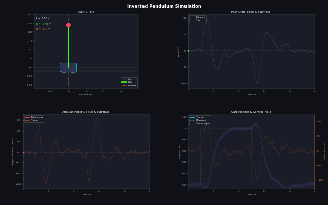
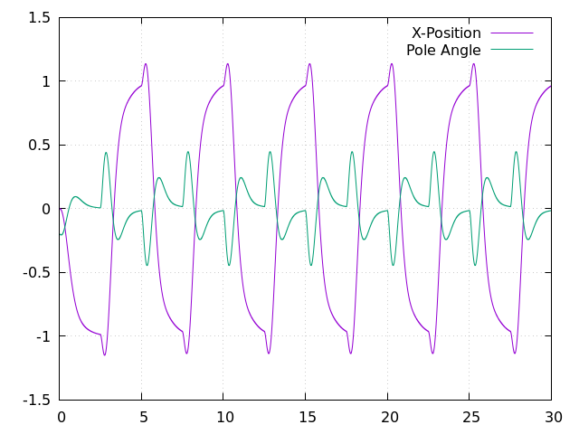
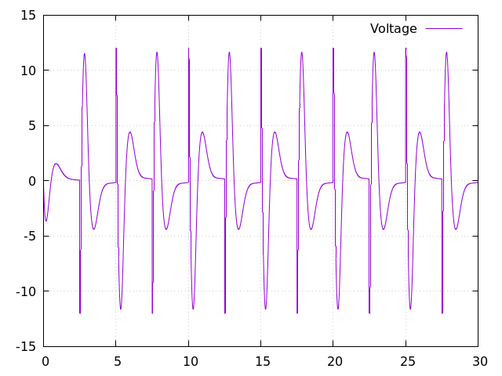

# Project Overview:
The simulation of the classic invertered pendulum controls problem. The hope is to increase complexity in the controller and system design to improve fidelity of the state-space model and design more sophisticated controllers around the model.

If you have suggestions on what kind of control to implement, areas of research, code improvements, research papers to look at, hardware suggeestions, bug fixes, open problems in controls and inverted pendulums feel free contact me at muhtasim1023@gmail.com. Still trying to figure out github workflow so feel free to suggest tips on how to improve the repo.

    

# Build Instructions
In order to build the project you must have cmake installed. With cmake installed you can run the following commands:

`cmake --build build`

This will invode the build tool native to your system like make for the project which should already be configured in a build directory.

Now we can run the binary file and a data.csv file should be created.

`./build/inverted_pendulum`

Finally we can plot the graphs. First with the X-Position of the cart and the pole angle. Second one with the input voltage signal.

`gnuplot -p -e "set grid; set datafile separator ','; plot 'pendulum_sim.dat' using 1:2 w l title 'X-Position', '' using 1:3 w l title 'Pole Angle' "`

`gnuplot -p -e "set grid; set datafile separator ','; plot 'pendulum_sim.dat' using 1:4 w l title 'Voltage'"`

Example Output:

 

## Tentitive Plan:

__Phase I - Single Pendulum Simulation:__ *Equations of motion · Euler/RK4 integrator · Visualization · PID angle then cascaded cart+angle · Add friction · Encoder quantization · Motor deadband · Kalman / EKF noise estimation · LQR · Pole placement · Full state feedback · Lyapunov stability · swing-up energy method*

__Phase II - STM32 Model Build:__ *Encoder + IMU sensing · Motor driver · Real-time loop · Port PID from sim*

__Phase III - Double Pendulum Simulation & Hardware:__ *Lagrangian derivation · Chaos sensitivity · UKF state estimation · LQR near equilibrium*

__Phase IV - Data-Driven Double Pendulum:__ *RL (PPO/SAC) · MPC · Generalized moment / Beneš filter comparison*

__Phase V - Triple Pendulum Simulation & Hardware:__ *Higher-order Lagrangian · Mechanical design challenge · Structural resonance*

__Phase VI - Deep-Learning & Transformers On Triple:__ *LSTM policy · Decision transformer · World model · Sim-to-real transfer*

__Phase VII - Benchmarking:__ *Estimator benchmarks · Control hierarchy comparison · Literature gaps*

## Updates:
Updates on the project here.
### March 13, 2026 ~ March 22, 2026
Phase I - Obtain the linear system model of the inverted pendulum

Kinematics: Position of the Pendulum Bob $(x_b, y_b)$

$x_b = x + L\sin(\theta)$

$\dot x_b = \dot x + L\dot \theta \cos(\theta)$

$y_b = L\cos(\theta)$

$\dot y_b = -L \dot \theta \sin(\theta)$

**Kinetic Energy: 2 sources of kinetic energy (Cart + Pendulum Bob)**

$$T = \frac 1 2 M \dot x^2 + \frac 1 2 m(\dot x_b^2 + y_b^2)$$

$$T = \frac 1 2 (M + m)\dot x^2 + mL\dot x \dot \theta \cos(\theta) + \frac 1 2 mL^2\dot \theta^2$$

**Potential Energy:**  $V = mgL\cos (\theta)$

**Lagrangian:** $\mathcal L = T - V$

$$\boxed{\mathcal L = \frac 1 2 (M + m)\dot x^2 + mL\dot x \dot \theta\cos(\theta) + \frac 1 2 mL^2\dot \theta^2 - mgL\cos (\theta)}$$

**[[Euler-Lagrange Equation]] for $q_1 = x$:**

$$\frac{\partial \mathcal L}{\partial \dot x} = (M + m)\dot x + mL\dot\theta cos(\theta)$$

$$\frac{d}{dt} \left( \frac{\partial \mathcal L}{\partial \dot x} \right) = (M + m)\ddot x + mL\ddot\theta cos(\theta) - mL\dot \theta^2 sin(\theta)$$

$$\frac {\partial \mathcal L}{\partial x} = 0$$

$$\frac{d}{dt} \left( \frac{\partial \mathcal L}{\partial \dot x}\right) - \frac{\partial \mathcal L}{\partial x} = F$$

$$\boxed{\left(M + m \right)\ddot x + mL\ddot\theta\cos(\theta) - mL\dot\theta^2\sin(\theta) = F}$$

**Euler-Lagrange Equation for $q_2 = \theta$:**

$$\frac{\partial\mathcal L}{\partial\dot\theta} = mL\dot x\cos(\theta) + mL^2\dot\theta$$

$$\frac{d}{dt}\left(\frac{\partial\mathcal L}{\partial\dot\theta}\right) = mL\ddot x\cos(\theta) - mL\dot x\dot\theta\sin(\theta) + mL^2\ddot\theta$$

$$\frac {\partial \mathcal L}{\partial\theta} = mL\sin(\theta)\left(g-\dot x\dot\theta\right)$$

$$\frac{d}{dt} \left( \frac{\partial\mathcal L}{\partial\dot\theta}\right) - \frac{\partial \mathcal L}{\partial\theta} = \mathcal T$$

**Generalized Force $Q_\theta = \mathcal T = 0$ (no torque applied directly to pendulum):**

$$mL\ddot x\cos(\theta) - mL\dot\theta\dot x \sin(\theta) + mL^2\ddot\theta + mL\dot\theta\dot x \sin(\theta) -mgL\sin(\theta) = 0$$

$$mL\ddot x\cos(\theta) + mL^2\ddot\theta - mgL\sin(\theta) = 0$$

$$\boxed{\ddot x\cos(\theta) + L\ddot\theta - g\sin(\theta) = 0}$$

**The Nonlinear Equation of Motion:**

$$\left(M + m \right)\ddot x + mL\ddot\theta\cos(\theta) - mL\dot\theta^2\sin(\theta) = F$$

$$\ddot x\cos(\theta) + L\ddot\theta - g\sin(\theta) = 0$$

Here is a set of Nonlinear coupled ODEs $\ddot x ,\ddot\theta$ are in both equations

Explicit solution to: $\ddot x$ and $\ddot\theta$.

$$\begin{bmatrix}(M+m) & mL\cos\theta \\ 
m\cos\theta & mL \end{bmatrix} 
\begin{bmatrix} \ddot x \\ 
\ddot\theta \end{bmatrix} = 
\begin{bmatrix} F + mL\dot\theta^2\sin\theta \\ 
mg\sin\theta \end{bmatrix}$$

To solve this explicitly we need to perform a matrix inversion on A which will involve solving its determinant $Ay=b$ and  $y=A^{-1}b$.

Let us say:

$$M = \begin{bmatrix} (M+m) & mL\cos\theta\\
m\cos\theta & mL \end{bmatrix}$$

The $det(M)$ would equal to the following:

$$det(M) = mL(M+m) -m^2L\cos^2\theta$$

$$det(M) = mL(M+m\sin^2\theta)$$

$$M^{-1} = \frac{1}{det(M)} 
\begin{bmatrix} mL & -mL\cos\theta\\ 
-m\cos\theta & (M+m) 
\end{bmatrix}$$

Thus the explicit solution for $\ddot x$ and $\ddot\theta$:

$$\begin{bmatrix} \ddot x \\ 
\ddot\theta \end{bmatrix} = 
\frac{1}{mL(M+m\sin^2\theta)} 
\begin{bmatrix} mL & -mL\cos\theta \\
-m\cos\theta & (M+m) \end{bmatrix}
\begin{bmatrix} F + mL\dot\theta^2\sin\theta\\
mg\sin\theta \end{bmatrix}$$

$$\boxed{\ddot x = \frac{F + mL\dot\theta^2\sin\theta - mg\sin\theta\cos\theta}{M + m\sin^2\theta}}~~~~~~~\boxed{\ddot\theta = \frac{(M+m)g\sin\theta - \cos\theta(F + mL\dot\theta^2\sin\theta)}{L(M+m\sin^2\theta)}}$$

Now we can linearize the dynamic equations using a first order Taylor Series approximation: $\sin\theta = \theta,\cos\theta = 1, \dot\theta^2\sin\theta = 0$

$$\boxed{(M+m)\ddot x + mL\ddot\theta = F}$$

$$mL\ddot x + mL^2\ddot\theta - mgL\theta = 0$$

$$\ddot x + L\ddot\theta - g\theta = 0$$

$$\boxed{\ddot x = g\theta - L\ddot\theta}$$

The resulting State-Space Systems:

$$
x=\begin{bmatrix}
x\\
\dot x\\
\theta\\
\dot\theta
\end{bmatrix}~
A=\begin{bmatrix} 
0&1&0&0\\
0&0&-\frac{mg}{M}&0\\
0&0&0&1\\
0&0&\frac{(M+m)g}{ML}&0
\end{bmatrix}~
B=\begin{bmatrix}
0\\
\frac{1}{M}\\
0\\
-\frac{1}{ML}
\end{bmatrix}
$$

$$
\dot x = 
\begin{bmatrix} 
0&1&0&0\\
0&0&-\frac{mg}{M}&0\\
0&0&0&1\\
0&0&\frac{(M+m)g}{ML}&0
\end{bmatrix}x~+~
\begin{bmatrix}
0\\
\frac{1}{M}\\
0\\
-\frac{1}{ML}
\end{bmatrix}u
$$

Here $u(t)$ is the input force applied to drive the cart's position. A few key important details were left out in this model derivation such as the moment of inertio of the cart and the pole, the coefficient of friction of the joint which will dampen the pole's motion, also we don't have a model for what is providing the input force $u(t)$ or how this force is being driven. 

If we drive the system with a DC motor we need to include the model dynamics for a DC motor into the system. Additionally, we are under the assumption that we are dealing with a full-state feedback system: 

$$ 
y = Ix 
$$ 

In other words, all state variables are observable with no noise, *not always the case*.

### March 23, 2026
Phase I - Obtain the linear system model of the inverted pendulum

Given our inverted pendulum system: 
$$
\dot x = 
\begin{bmatrix} 
0&1&0&0\\
0&0&-\frac{mg}{M}&0\\
0&0&0&1\\
0&0&\frac{(M+m)g}{ML}&0
\end{bmatrix}x~+~
\begin{bmatrix}
0\\\frac{1}{M}\\0\\-\frac{1}{ML}
\end{bmatrix}u
$$

We can design an input response proportional to the state $u = -Kx$, such that the eigen values of the system $A-BK$ are on the left hand side of the complex plane. This is done by either equating the coefficients of the characteristic equation of the system $A-BK$ and the characteristic polynomials with the roots as the eigen values: 

$$P_{des}(s) = (s - \lambda_1)(s - \lambda_2)(s - \lambda_3)(s - \lambda_4)$$

$$P_{des}(s) = s^4 + \alpha_3 s^3 + \alpha_2 s^2 + \alpha_1 s + \alpha_0$$

And equate the coefficients with the system's characteristic equation:

$$ P_{act}(s) = det(sI - (A-BK)) $$

$$ P_{act}(s) = s^4 + (f_3(K))s^3 + (f_2(K))s^2 + (f_1(K))s + (f_0(K))$$

$$
\begin{bmatrix}
f_3(k_1, k_2, k_3, k_4) \\
f_2(k_1, k_2, k_3, k_4) \\
f_1(k_1, k_2, k_3, k_4) \\
f_0(k_1, k_2, k_3, k_4) \\
\end{bmatrix} = 
\begin{bmatrix}
\alpha_3 \\
\alpha_2 \\
\alpha_1 \\
\alpha_0 \\
\end{bmatrix}
$$

We can now solve the system of linear equations to solve for the values of $k_1, k_2, k_3, k_4$ and use it to construct the control signal $u = -Kx$. Another way to calculate the constants of $K$ matrix is to use Ackermann's Formula by calculate the controllability matrix and defining a desired polynomial $P(A) = A^4 + \alpha_3A^3 + \alpha_2A^2 + \alpha_1A + \alpha_0$ and calculate K, $K = [0, 0, 0, 1]C^{-1}P(A)$.

Here is an example $m = 0.1, M = 1, l = 0.5, g = 9.80665$ the system equation $A, B, K$:

$$
A = 
\begin{bmatrix} 
0 & 1 & 0 & 0 \\
0 & 0 & -0.98 & 0 \\
0 & 0 & 0 & 1 \\
0 & 0 & 21.57 & 0 \\ 
\end{bmatrix}
$$

$$
B = 
\begin{bmatrix}
0 \\
1 \\
0 \\
-2 \\
\end{bmatrix}
$$

$$
K = 
\begin{bmatrix}
k_1, k_2, k_3, k_4
\end{bmatrix}
$$

Using the characteristic polynomial: 

$$det(sI - (A-BK)) = k_1s^2 - 19.61k_1 + k_2s^3 -19.61k_2s - 2k_3s^2 + 2k_4s^3 + s^4 - 21.52s^2 = 0$$

And the desired characteristic polynomial:

$$ P_{des}(s) = s^4 + 5s^3 + 9.35s^2 + 7.75s + 2.4024$$

Setup the system of equations and solve:

$$ 
\begin{bmatrix}
0 & 1 & 0 & -2 \\
1 & 0 & -2 & 0 \\
0 & -19.61 & 0 & 0 \\
-19.61 & 1 & 0 & 0 \\
\end{bmatrix}
\begin{bmatrix}
k_1 \\
k_2 \\
k_3 \\
k_4 \\
\end{bmatrix} =
\begin{bmatrix}
5\\
9.32 + 21.57\\
7.75\\
2.4024\\
\end{bmatrix}
$$

$$
\begin{bmatrix}
k_1 \\
k_2 \\
k_3 \\
k_4 \\
\end{bmatrix} =
\begin{bmatrix}
-0.1225\\
-0.3952\\
-15.5213\\
-2.6976\\
\end{bmatrix}
$$

We now have the constants needed for to push the poles to the left plane, and for faster response we can choose larger negative eigen values.

### March 24, 2026
Phase I - Obtain the linear system model of the inverted pendulum, 

- Modeled non-linear dynamics
- Tested Open-Loop Response 
- Tested gain matrix K calculated for linearized system on non-linear system

### March 25, 2026
Derived gains to control non-linear model using LQR controls gains were calculated using Matlab's lqr function.

### March 31, 2026
Derived the dynamic equations of driving the inverted pendulum with a DC motor rather than a linear force input: 

Starting with the Faraday's Law of Induction and Ampere's Law for a force produced on a conductor in a magnetic field.

$$
J\ddot\theta=K_1i
$$ 

$$
v=K_2\dot\theta
$$

Using Ohm's Law we can write the above two relations as one equations:

$$
(e-v) = Ri
$$

$$
J\ddot\theta = \frac{K_1}{R}e-\frac{K_1K_2}{R}\dot\theta
$$

Moving forward we are going to assume the moment of inertia of the wheel attached to the DC motor shaft is negligible. Now we can incorporate the above ODE with the linearized equations for the Inverted pendulum to come up with the consolidated model using a Torque to Force relation $\mathcal{T}=rF$.

$$
\boxed{(M+m)\ddot x + mL\ddot\theta = F} ~~~ \boxed{\ddot x = g\theta - L\ddot\theta}
$$

$$
((M+m)\ddot x + mL\ddot\theta)r = Fr = \mathcal{T}
$$

$$
((M+m)\ddot x + mL\ddot\theta)r = \frac{K_1}{R}e - \frac{K_1K_2}{R}\dot\theta
$$

$$
\ddot\theta = \frac{1}{MLr}(Mgr\theta + mg\theta r - \frac{K_1}{R}e + \frac{K_1K_2}{R}\dot\theta)
$$

$$
\ddot\theta = \frac{(M+m)g}{ML}\theta - \frac{K_1}{MLrR}e + \frac{K_1K_2}{MLr^2R}\dot x
$$

Similarly, we can obtain the equation for $\ddot x$:

$$
((M+m)\ddot x + mL(\frac{g\theta - \ddot x}{L}))r = \frac{K_1}{R}e - \frac{K_1K_2}{R}\dot\theta
$$

$$
M\ddot x + mg\theta = \frac{K_1}{rR}e - \frac{K_1K_2}{r^2R}\dot x
$$

$$
\ddot x = \frac{K_1}{rMR}e - \frac{K_1K_2}{r^2MR}\dot x - \frac{mg\theta}{M} 
$$

With the above two equations we are able to see the control response with a voltage input to a DC motor. The new state-space model: 

$$
\dot x = 
\begin{bmatrix} 
0&1&0&0\\
0&-\frac{K_1K_2}{r^2MR}&-\frac{mg}{M}&0\\
0&0&0&1\\
0&\frac{K_1K_2}{r^2MLR}&\frac{(M+m)g}{ML}&0
\end{bmatrix}x~+~
\begin{bmatrix}
0\\
\frac{K_1}{rMR}\\
0\\
-\frac{K_1}{rMLR}
\end{bmatrix}e
$$

### April 1, 2026

Previously, Matlab was used to calculate the optimal gains using the lqr() function available in the matlab control library. The function outputs the full-state feedback gain matrix K, the unique stabilized solution to the continuous-time Ricatti Equation X, and the closed-loop poles L.

For the system: $\dot x = Ax + Bu$ at the initial value of $x(0) = x_0$ the gains of the full state-feedback system can be calculated by setting up a cost function:

$$
\dot x = (A-BK)x
$$

$$
J(x_0) = \int_0^\infty{(x'Qx + u'Ru + 2x'Su)dt}
$$

And the closed-loop poles will be the eigen values and of the state-transition matrix $\phi_c=A-BK$.

$$
L = det(\phi_c-\lambda I)
$$

But we can do this step ourselves in software to find the optimal gain matrix K. Given our new system with the DC motor we can calculate optimal gain matrix by solving the algebraic ricatti equation.

### April 3, 2026

Obtained the gain matrix for inverted pendulum system with the DC motor and created options to switch between slow, fast and optimal controls.

Here are the Q and R matrices used to compute the optimal gains for the DC motor driven inverted pendulum model. 

$$
Q = \begin{bmatrix} 
200&0&0&0\\
0&1&0&0\\
0&0&10&0\\
0&0&0&1\\
\end{bmatrix}~~~
R = 2
$$

Next steps might be to:
- Develop the Energy-Swing Meneuver
- Implement a Kalman Filter for position and angle estimation
- Create ARE solver in C
- Encoder/Sensor Quantization (Sensor Modeling)
- Friction Modelling

### April 8, 2026
- Migrated C++ files to C11

### April 9, 2026
- Fixed a few migration bugs and stoped tracking C++ files
- Hopes are that we can use these C files in embedded systems inverted pendulum

### April 13, 2026
- Updating minor bug fixes
- Improving overall code quality and refactoring physics functions to remove repeating syntax

### April 18, 2026
- Removed code repetitions and removed repeating code
- Moving forward we will be working on the estimation side of the inverted pendulum
- Adding a simulated Encoder for measuring the pole angle with noise would be th next thing to do 

