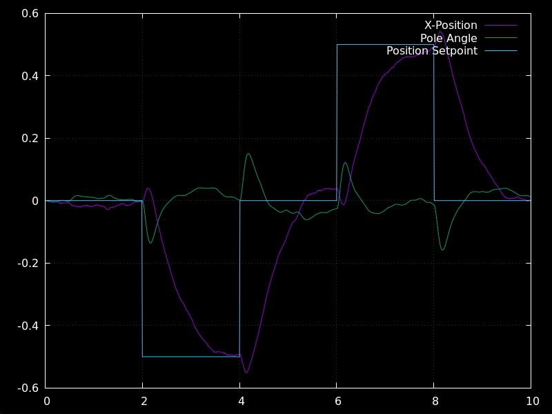
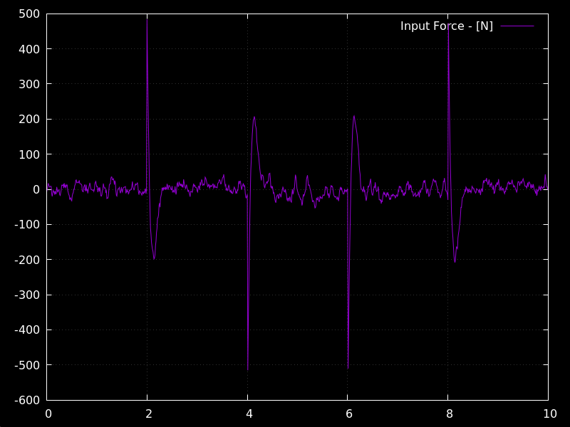
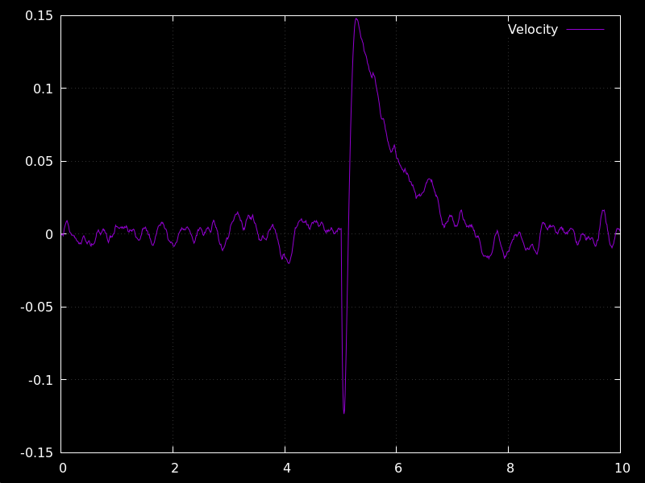
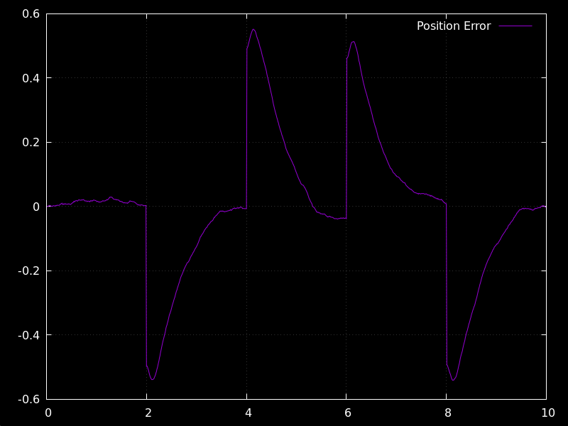

# Project Overview:
The simulation of the classic invertered pendulum controls problem. The hope is to increase complexity in the controller and system design to improve fidelity of the state-space model and design more sophisticated controllers around the model.

If you have suggestions on what kind of control to implement, areas of research, code improvements, research papers to look at, hardware suggeestions, bug fixes, open problems in controls and inverted pendulums feel free contact me at muhtasim1023@gmail.com. Still trying to figure out github workflow so feel free to suggest tips on how to improve the repo.

    

# Build Instructions
In order to build the project you must have cmake installed. With cmake installed you can run the following commands:

`cmake --build build`

This will invode the build tool native to your system like make for the project which should already be configured in a build directory.

Now we can run the binary file and a data.csv file should be created.

`./build/inverted_pendulum`

Finally we can plot the graphs using GNU plot.

Run the following bash script: `./plot.sh`

Example Output:

 
 

## Tentitive Plan:

__Phase I - Single Pendulum Simulation:__ *Equations of motion · Euler/RK4 integrator · Visualization · PID angle then cascaded cart+angle · Add friction · Encoder quantization · Motor deadband · Kalman / EKF noise estimation · LQR · Pole placement · Full state feedback · Lyapunov stability · swing-up energy method*

__Phase II - STM32 Model Build:__ *Encoder + IMU sensing · Motor driver · Real-time loop · Port PID from sim*

__Phase III - Double Pendulum Simulation & Hardware:__ *Lagrangian derivation · Chaos sensitivity · UKF state estimation · LQR near equilibrium*

__Phase IV - Data-Driven Double Pendulum:__ *RL (PPO/SAC) · MPC · Generalized moment / Beneš filter comparison*

__Phase V - Triple Pendulum Simulation & Hardware:__ *Higher-order Lagrangian · Mechanical design challenge · Structural resonance*

__Phase VI - Deep-Learning & Transformers On Triple:__ *LSTM policy · Decision transformer · World model · Sim-to-real transfer*

__Phase VII - Benchmarking:__ *Estimator benchmarks · Control hierarchy comparison · Literature gaps*

